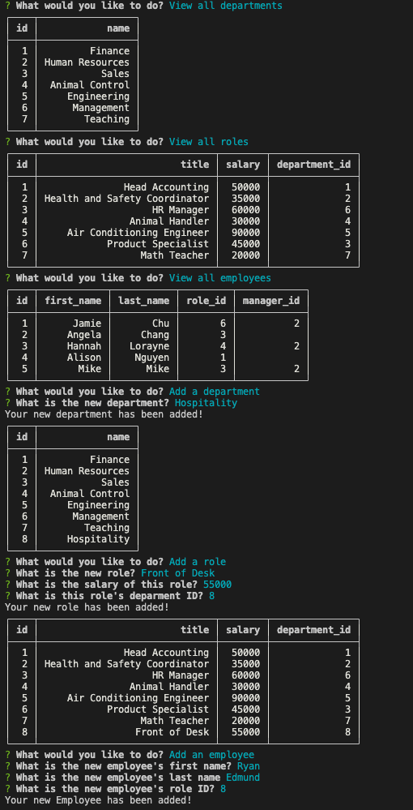

# employee-tracker

## Description

Use this app to view, add, or update your employees, their roles, and your deparments in your business!

## Usage

Simply use the terminal by entering "node index.js" and you will be prompted with a list of options to meet your goal. Each option will either take you to a list of information that you want to access, or you will be met with more prompts to update each list.

## Contact

github user : jamierose528
email : jamierosecreates@gmail.com

## How to Use Example

https://watch.screencastify.com/v/tNoU2mfuFvFn3sLjQgEI

## Screenshot

## Github Repo

https://github.com/jamierose528/employee-tracker

## Deployed Link
